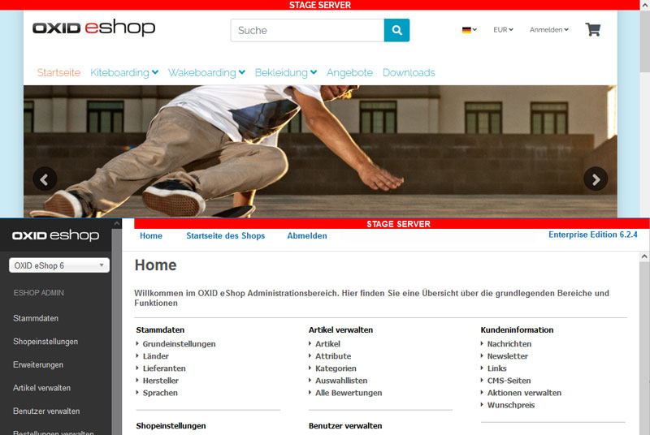

[](README.md)
[](README.en.md)

# D³ Stage Marker for OXID eShop

The module optionally displays a customisable bar in the front and/or back end that informs about the stage status of the current installation (production, test, development, ...).

The settings are saved as module settings.



## Table of content

- [Installation](#installation)
- [Usage](#usage)
- [Changelog](#changelog)
- [Contributing](#contributing)
- [License](#license)

## Installation

This package requires an Composer installed OXID eShop as defined in [composer.json](composer.json).

Open a command line interface and navigate to the shop root directory (parent of source and vendor). Execute the following command. Adapt the paths to your environment.

```bash
php composer require d3/stagemarker
``` 

Activate the module in the admin area of the shop in "Extensions -> Modules".

## Usage

In Shopadmin under "Extensions -> Modules", select the "Stage Marker" module and switch to the "Settings" tab. Set the desired settings for the installation.

## Changelog

Siehe [CHANGELOG](CHANGELOG.md) für weitere Informationen.

## Contributing

If you have a suggestion that would make this better, please fork the repo and create a pull request. You can also simply open an issue. Don't forget to give the project a star! Thanks again!

- Fork the Project
- Create your Feature Branch (git checkout -b feature/AmazingFeature)
- Commit your Changes (git commit -m 'Add some AmazingFeature')
- Push to the Branch (git push origin feature/AmazingFeature)
- Open a Pull Request

## Licence
(status: 2022-05-30)

Distributed under the GPLv3 license.

```
Copyright (c) D3 Data Development (Inh. Thomas Dartsch)

This software is distributed under the GNU GENERAL PUBLIC LICENSE version 3.
```

For full copyright and licensing information, please see the [LICENSE](LICENSE.md) file distributed with this source code.